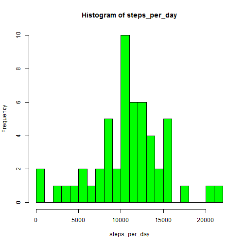
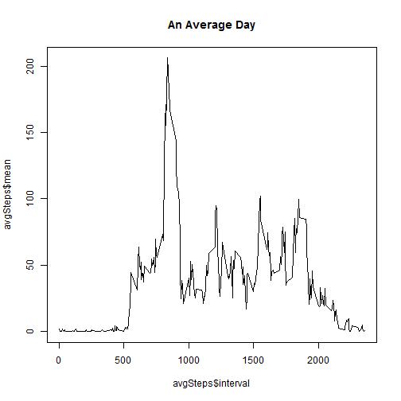
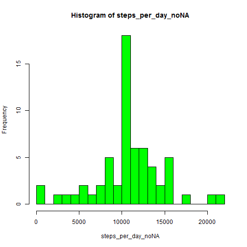
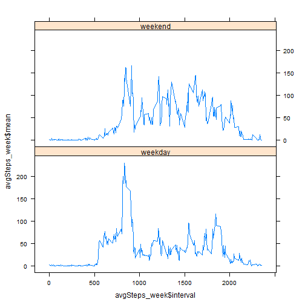

## Loading and preprocessing the data
Load required libraries

```r
      library(plyr)
      library(dplyr)
      library(lattice)
```

Unzip the activity.zip directory and read activity.csv to a data frame called "activity"

```r
      unzip("activity.zip")
      activity <- read.csv("activity.csv")
```

Convert date to class=Date and interval to 4 digit char then class=Date(time)

```r
      activity <- mutate(activity,date=as.Date(date,"%Y-%m-%d"))
      activity <- mutate(activity,time=sprintf("%04d",interval))
      activity$time <- format(strptime(activity$time,
                                       format="%H%M"),format="%H:%M")
      head(activity)
```

```
##   steps       date interval  time
## 1    NA 2012-10-01        0 00:00
## 2    NA 2012-10-01        5 00:05
## 3    NA 2012-10-01       10 00:10
## 4    NA 2012-10-01       15 00:15
## 5    NA 2012-10-01       20 00:20
## 6    NA 2012-10-01       25 00:25
```

```r
      activity <- mutate(activity,interval=as.numeric(as.character(interval)))
```
## What is mean total number of steps taken per day?
Sum the number of steps taken each day and plot in a histogram

```r
      steps_per_day <- tapply(activity$steps,activity$date,sum)
      hist(steps_per_day,breaks=20,col="green")
```



Find mean and median number of steps taken per day

```r
      mean(steps_per_day,na.rm=TRUE)
```

```
## [1] 10766.19
```

```r
      median(steps_per_day,na.rm=TRUE)
```

```
## [1] 10765
```

## What is the average daily activity pattern?
Create table of average interval values and plot

```r
      avgSteps<-ddply(activity,.(interval),summarize,mean=mean(steps,na.rm=TRUE))
      plot(avgSteps$interval,avgSteps$mean,type="l",main="An Average Day")
```



What interval has the most number of steps on average?

```r
      orderedSteps <- avgSteps[order(avgSteps$mean,decreasing=TRUE),]
      head(orderedSteps,1)
```

```
##     interval     mean
## 104      835 206.1698
```

## Imputing missing values
Count how many values are missing

```r
      sum(is.na(activity$steps))
```

```
## [1] 2304
```

Attach mean interval steps vector to activity dataframe to use for NA data

```r
      repeater <- rep(avgSteps$mean,each=1,times=61)
      activity_noNA <- cbind(activity,repeater)
```

Loop through steps column, replacing NA data with mean for that interval

```r
      for(i in 1:nrow(activity_noNA)){
            ifelse(is.na(activity_noNA$steps[i]),
                   activity_noNA$steps[i]<-activity_noNA$repeater[i],
                   activity_noNA$x<-"no")
      }
      activity_noNA <- select(activity_noNA,steps,date,interval,time)
```

Sum the number of steps taken each day and plot in a histogram

```r
      steps_per_day_noNA <- tapply(activity_noNA$steps,activity_noNA$date,sum)
      hist(steps_per_day_noNA,breaks=20,col="green")
```



Find mean and median number of steps taken per day

```r
      mean(steps_per_day_noNA,na.rm=TRUE)
```

```
## [1] 10766.19
```

```r
      median(steps_per_day_noNA,na.rm=TRUE)
```

```
## [1] 10766.19
```

Imputing mean interval times did not shift the mean, but shifted the median value to the mean.

Imputing the data increased the total number of daily steps taken by the user since there is now data where there was previously none. No data was eliminated.

## Are there differences in activity patterns between weekdays and weekends?

Determine if date falls of a weekday or a weekend

```r
      activity_noNA$weekday <- weekdays(activity_noNA$date)
      activity_noNA$daycat <- ifelse(activity_noNA$weekday=="Saturday",
             activity_noNA$daycat<-"weekend",
             ifelse(activity_noNA$weekday=="Sunday",
                    activity_noNA$daycat<-"weekend",
                    activity_noNA$daycat<-"weekday"))      
```

Create table of average interval values for week/weekend and plot

```r
      avgSteps_week<-ddply(activity_noNA,.(interval,daycat),summarize,
                           mean=mean(steps,na.rm=TRUE))
      xyplot(avgSteps_week$mean ~ avgSteps_week$interval | 
                   avgSteps_week$daycat, layout=c(1,2),type="l")
```


